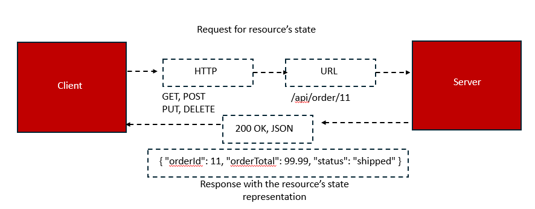
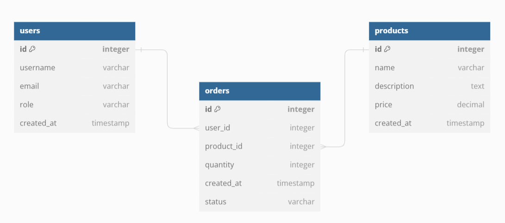

# REST API Architecture & Design.

Before dive into REST API Architecture, Let’s have a look at What an API is.

### What is an API

**API (Application Programming Interface)** is essentially a set of rules and protocols that allow different software applications to communicate and interact with each other. It's like a middleman that facilitates communication between two systems

### Why an API required?

APIs are essential for modern software development because they offer several advantages:

- **Efficiency:** APIs allow developers to reuse existing functionalities without building everything from scratch.
- **Integration:** They enable different applications to work together seamlessly, creating new and innovative services.
- **Scalability:** APIs can handle increased workloads, making systems more adaptable to growing demands.
- **Innovation:** They foster creativity by providing a platform for developers to build new applications and services on top of existing ones.

### API Types

### Operating System API

- **Purpose:** Provides a way for applications to interact with the underlying operating system.
- **Example:** Win32 API for Windows applications.
- **Key point:** Essential for accessing system resources like file systems, network devices, and user interface elements.

### Library API

- **Purpose:** Allows different components within a single application to communicate and share functionality.
- **Example:** Logging library, user library.
- **Key point:** Enhances code reusability and modularity within an application.

### Remote API

- **Purpose:** Enables communication between software components located on different machines.
- **Example:** DCOM, .NET Remoting, Java RMI.
- **Key point:** Requires a common development platform for both components and is less common due to the rise of web APIs.

### Web API

- **Purpose:** Facilitates communication between web applications over the internet.
- **Example:** Weather API, social media API.
- **Key point:** Platform-independent, uses standardized protocols, and is the most prevalent type of API today.

### Key differences:

- **Scope:** Operating system APIs are system-wide, library APIs are within an application, remote APIs are between components on different machines, and web APIs are between applications over the internet.
- **Protocols:** Operating system APIs and library APIs typically use language-specific mechanisms, while remote APIs and web APIs rely on network protocols.
- **Platform independence:** Web APIs are platform-independent, while the others are often tied to specific operating systems or development platforms.

### Importance of  API

**APIs are essential for modern software development.** They allow different applications to communicate, share data, and work together seamlessly.

- **Efficiency:** Reusing code and building faster.
- **Innovation:** Creating new products and services.
- **Integration:** Connecting different systems and platforms.
- **Scalability:** Handling increased workloads and growth.
- **Monetization:** Generating revenue through API access.

## Web APIs

- **SOAP**
    
    **SOAP** is a protocol for exchanging structured information in the form of XML messages. It uses an RPC-style request-response model.
    
    - **XML-based:** Messages are formatted in XML
    - **Extensible:** Can be adapted for various functions like authentication, security, and transaction management.
    - **Complex:** Known for its verbose and complex message structure.
    - **Outdated:** Generally considered outdated due to its verbosity and performance overhead compared to modern alternatives like REST.
        
        **Example:** A SOAP request to retrieve a stock price would be sent as an XML message specifying the desired stock and expecting an XML response with the price.
        
- **GraphQL**
    
    GraphQL is a newer way for computers to talk to each other. Unlike REST, which asks for a whole bunch of data. GraphQL allows clients to precisely specify the data they require in a single request.
    
    **Key characteristics:**
    
    - **Declarative data fetching:** Clients define the exact structure of data needed, reducing over-fetching and under-fetching common in REST APIs.
    - **Strong typing:** GraphQL utilizes a schema to define available data types and their relationships, enabling static type checking and improved development experience.
    - **Increased efficiency:** By fetching only required data, GraphQL can optimize network traffic and reduce response times.
    - **Complex data modeling:** GraphQL excels at representing complex data structures and relationships, making it suitable for applications with intricate data requirements.
    
    **Trade-offs:**
    
    - **Implementation complexity:** GraphQL requires additional server-side logic and infrastructure compared to REST.
    - **Performance overhead:** In certain scenarios, GraphQL might introduce performance overhead due to increased query parsing and execution complexity.
- **gRPC**
    
    **gRPC** is a modern way for computers to talk to each other that's really fast. It uses a special language called Protobuf to define messages and then sends them over the internet.
    
    **Key points:**
    
    - **Speed:** It's very fast because it uses a new internet protocol called HTTP/2.
    - **Two-way conversation:** Unlike older methods, it can send information back and forth at the same time.
    - **Simple messages:** It uses a simple format for messages, which saves time.
    - **Not as popular:** While it's great for performance, it's not as widely used as other methods yet.
    
    **In short:** gRPC is a high-performance way to build fast and efficient online services, but it's still a newer technology compared to REST and GraphQL.
    
- **REST**
    
    ### What is REST?
    
    **REST** stands for **REpresentational State Transfer**. It's an architectural style for designing networked applications. It's a way to build APIs that let different software systems communicate over the internet.
    
    REST uses simple web addresses (URLs) and sends and receives data in a format called JSON.
    
    ### How does REST work?

A REST API focuses on transferring data (representations) of resources. Here's a breakdown:

- **Resource:** A resource is any entity or concept that can be named, identified, and accessed. Examples include a user, a product, or a blog post.
- **Representation:** This is how a resource is presented. It's usually in a format like JSON or XML.
- **State:** The state of a resource is its current condition or data. For example, a orders' state might include its order_id, total, and status.

### Structure Of REST API Request

| Term | Description |
| --- | --- |
| Method | HTTP Verb (GET, POST, PUT, DELETE, etc.) |
| URL | Location of the resource + parameters |
| Headers | Meta-data of the request (User Agent, Content-Type, Authorization, etc.) |
| Body | Contents of the request (optional) |

### Structure Of REST API Response

| Term | Description |
| --- | --- |
| Status Code | Indicates the success or failure of the request (e.g., 200 OK, 404 Not Found) |
| Headers | Metadata about the response (Content-Type, Date, Server, etc.) |
| Body | Contents of the request (optional) |

### Design a REST API Architecture

Designing a REST API involves a systematic approach to ensure it's efficient, maintainable, and user-friendly. 

### 1. **Define the API's Purpose and Scope**

- Clearly state the API's objective. What value does it provide? For Example a platform for developers to create and manage online stores.
- Identify the primary users of API.
- Identify the resources the API will manage. for example:- users, products, orders.
- Determine the CRUD operations (Create, Read, Update, Delete) required for each resource.

### 2. **Design Resource Structure**

- Model data as resources users, products, orders.
    
    
    

### 3. **Define API Endpoints**

1. HTTP VERBS
2. URL Structure
3. Response Codes
    
    **Response codes** are essential components of REST APIs that communicate the outcome of a request to the client. They provide clear and concise information about the request's success or failure and the reason for any errors.
    
    - **Informative:** Response codes tell clients whether the request was successful or not.
    - **Actionable:** Clients can make decisions based on the response code (e.g., retry, display error message).
    - **Monitoring:** Tools can use response codes to track API health and performance.
    - **Simplicity:** Response codes improve API usability by providing clear feedback.
    
    HTTP status codes are three-digit numbers that indicate the status of a recent HTTP request.
    
    | Category | Code Range | Description | Common Codes |
    | --- | --- | --- | --- |
    | Informational | 100-199 | Request received, continuing process | 100, 101, 110 |
    | Successful | 200-299 | Action was successfully received, understood, and accepted | 200, 201, 202, 204 |
    | Redirection | 300-399 | Further action must be taken to complete the request | 301, 302, 304 |
    | Client Error | 400-499 | The request contains bad syntax or cannot be fulfilled | 400, 401, 403, 404, 405 |
    | Server Error | 500-599 | The server failed to fulfill an apparently valid request | 500, 502, 503, 504 |
- Create logical endpoints based on resources and actions. HTTP verbs are essential in REST APIs to indicate the desired action on a resource. The most common actions are CRUD (Create, Read, Update, Delete), which align with the corresponding HTTP methods.
    - **GET:** Retrieves a resource.
    - **POST:** Creates a new resource.
    - **PUT:** Updates an entire resource.
    - **DELETE:** Deletes a resource.
- Ensure endpoint paths are clear and consistent.
    
    Utilize **Beeceptor** tool for mocking APIs based on the defined resource model. By effectively using Beeceptor, you can accelerate development, improve collaboration, and reduce dependencies.
    
    - **Rapid Prototyping:** Quickly create mock endpoints without extensive backend development.
    - **Isolation:** Test frontend or other components independently without relying on a fully functional backend.
    - **Flexibility:** Easily simulate various response scenarios, error conditions, and data formats.
    - **Collaboration:** Share mock endpoints with team members for parallel development.
    
    ### How to Use Beeceptor:
    
    1. **Define Endpoints:** Based on your resource model, create endpoints for CRUD operations (Create, Read, Update, Delete) for users, products, and orders.
    2. **Mock Responses:** Define sample JSON or XML responses for different HTTP methods (GET, POST, PUT, DELETE) and status codes.
    3. **Configure Request Matching:** Specify conditions for matching incoming requests (e.g., URL parameters, headers, request body).
    4. **Test Integration:** Integrate your frontend or other components with the mocked endpoints to verify functionality.
    
    ### Example Endpoints:
    
    Use nouns for resource names (e.g., /users, /products,/orders).
    
    Consider hierarchical relationships between resources (e.g., /users/:userId/orders).
    
    - **Users:**
        - `/users`: GET to retrieve a list of users
        - `/users/{id}`: GET to retrieve a specific user, POST to create a user, PUT to update a user, DELETE to delete a user
    - **Products:**
        - `/products`: GET to retrieve a list of products
        - `/products/{id}`: GET to retrieve a specific product
    - **Orders:**
        - `/orders`: GET to retrieve a list of orders for a user, POST to create an order
        - `/orders/{id}`: GET to retrieve a specific order

### 4. **Choose Data Formats**

- Select appropriate data formats (JSON, XML) based on requirements. I prefer SON for its simplicity and widespread adoption

### 5. **Implement HTTP Status Codes**

- Use appropriate HTTP status codes to indicate response outcomes.
- Provide informative error messages for non-200 responses.

### 6. **Handle Authentication and Authorization**

- Implement secure authentication mechanisms (e.g., OAuth, API keys).
- Define authorization rules to control access to resources.

### 7. **Error Handling**

- Design a consistent error handling strategy.
- Return informative error messages with appropriate HTTP status codes.

### 8. **Versioning**

- Plan for API versioning to accommodate changes.
- Consider using URL paths or custom headers for versioning.

### 9. **Documentation**

- Create clear and comprehensive API documentation.
- Include examples, code snippets, and interactive tools.

### 10. **Testing and Refinement**

- Thoroughly test the API to identify and fix issues.
- Gather feedback from developers and users to improve the API.

### Additional Considerations:

- **Performance optimization**: Implement caching, load balancing, and database optimization.
- **Security**: Protect against vulnerabilities like SQL injection, cross-site scripting (XSS), and unauthorized access.
- **Rate limiting**: Prevent abuse by limiting API requests.
- **Scalability**: Design the API to handle increasing traffic and data volumes.
- **API design patterns**: Explore patterns like HATEOAS for advanced API design.